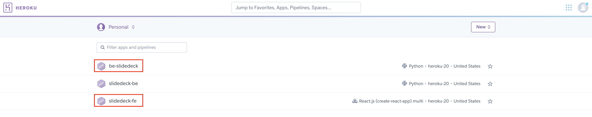
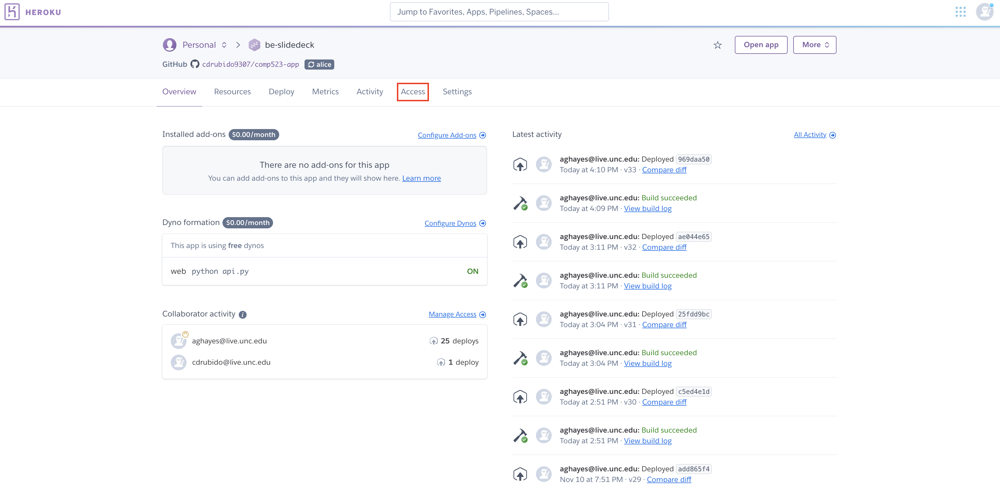
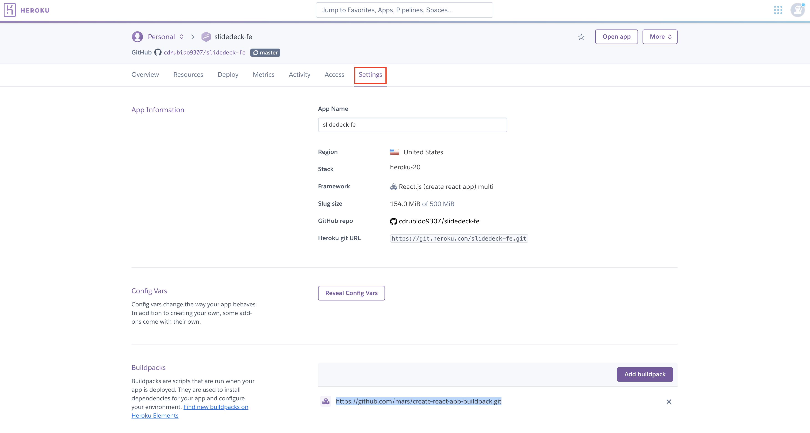
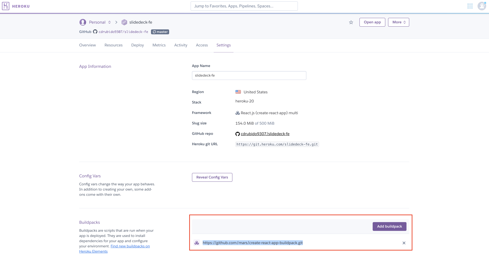

# Slidedeck - Immunohistochemical Validation Forms

Currently immunohistochemical validations are done by hand in a weekly basis which generates an extensive amount of paperwork and sometimes errors due to terrible doctors handwriting. Our main goal in this project is to say no more Indecipherable doctor handwriting, and create a digital system to improve the workflow on the pathologist lab at UNC Health.

## Getting Started

### 1. General Prerequisites
To setup the development environment install the following global dependencies.

    - [Python 3.6 or greather](https://www.python.org/)
    - [PIP3](https://pip.pypa.io/en/stable/)
    - [NodeJs 16 or greather](https://nodejs.org/en/)

### 2. FrontEnd Prerequisites
Before getting started with frontend development make sure the following requirements are installed using the NodeJs package manager **npm**:

    - tailwindcss
    - craco
    - axios
    - react-helmet-async
    - react-icons
    - react-router-dom

### 3. BackEnd Prerequisites
Before getting started with backend development make sure the following requirements are installed using the Python package manager **pip**:

    - aniso8601==9.0.1
    - asgiref==3.4.1
    - click==8.0.1
    - coverage==6.0.2
    - Flask==2.0.1
    - Flask-Cors==3.0.10
    - Flask-RESTful==0.3.9
    - gunicorn==20.1.0
    - importlib-metadata==4.8.1
    - itsdangerous==2.0.1
    - Jinja2==3.0.1
    - MarkupSafe==2.0.1
    - pymongo==3.12.0
    - pytz==2021.1
    - six==1.16.0
    - sqlparse==0.4.2
    - typing-extensions==3.10.0.2
    - Werkzeug==2.0.1
    - zipp==3.5.0
    - dnspython==1.16.0

### 4. Testing Prerequisites
For frontend testing use **CypressJS** which has the following dependecies:

    - cypress: https://www.cypress.io/
    - mocha (For testing report generation): https://mochajs.org/

Use NodeJs package manager **npm** to install those dependencies.

For backend testing use the following dependencies:

    - coverage
    - flask-unittest
    - Local instance of mongodb

### 5. Installing
Step by step installation process:

    1. Clone backed repo: 
    `git clone https://github.com/cdrubido9307/comp523-app.git`

    2. Install Backend dependencies (Make sure your current directory is the backend cloned directory. It should contain a file named requirements.txt):
    `pip install -r requirements.txt`

    3. Clone frontend repo:
    `git clone https://github.com/cdrubido9307/slidedeck-fe.git`

    4. Install Frontend dependencies (Make sure your current directory is the frontend cloned directory. It should contain a file named pakage.json):
    `npm install`


### 6. Running Locally
To start a local instance of the flask server once all the backend dependencies are installed you can navigate to the folder where the backend flask app is located (it should contain a file named api.py) and you should be able to start api.py as a regular python program:

    `python api.py`

To start a local instance of the front end application navigate to the frontend react application folder. Once you are there run the command:

    `npm start`

### 7. Warranty
The application should work in most operating systems as long as all the requirements are met. However, we strongly recommend using a Linux based operating system.

## Testing

### 1. Frontend Testing
Before trying to create any frontend testing make sure all your testing prerequisites are up to date.

    1. Navigate to the cypress folder then click on integration. In the integration folder is where you will add all your test for the frontend. To create a new test right click on the integration folder and create a new file with the name of your test, for example `test1.js`.

    2. Once you have your test file you can start writting your test cases. For more information on how to use or create test cases please visit: https://docs.cypress.io/guides/overview/why-cypress.

    3. Once you have finish writting your test you can proceed to run your test using the cypress dashboard. To do this fire up your terminal and navigate to the project folder where your cypress folder is and run the command: `node_modules/.bin/cypress open`. This command will open a new window with your cypress dashboard. After this you can go ahead and click on the test you want to run.

    4. Once you are satisfied with all tests and you are ready to generate a testing report run the following commands:

        1. `npx cypress run --reporter mochawesome`

        2. `npx mochawesome-merge cypress/report/mochawesome-report/*.json > cypress/report/output.json`

        3. `npx marge cypress/report/output.json --reportDir ./ --inline`

    5. After you run the commands you will have an html file named output.html with you test report coverage. Open the html file in your browser to analyze the test report coverage.

### 2. Backend Testing
Tests.py contains all of the tests for the backend code. The class ADatabaseTests contains tests for database.py. It is written purely using vanilla unittest. The class qApiTests contains tests for api.py. It is written using vanilla unittest as well as the library flask-unittest.

**Adding Test**
In order to add tests for database.py, declare a new method in the ADatabaseTests the method name should start with "test_". Note that unittest runs the tests in the alphabetical order of the method names. Thus it is easiest to follow "test_" with letters that ensure it is run after other necessary methods are run.

Adding tests for api.py is done by adding more test code to the bottom of the test_q_register method. You could declare new methods, but since many of the api endpoint tests rely on previous information it is easier to test api.py using one long integration test. Note that the api tests run after the database tests. This is a choice, but running api tests in the middle of database tests or vice versa will likely break the test suite.

**Running Test**
Before you can run the test suite you must install mongodb locally. You also must ensure that it is running before executing the test suite. To run the tests run "python tests.py". To generate an html report of the test coverage run "python -m coverage run -m tests.py" to run the test suite. Then run "python -m coverage html" to generate the html test coverage report in the htmlcov directory.

## Deployment
The project deployment interface is hosted in 2 separate Heroku app. A frontend react app and a backend flask application that supports the project's API. To get access to both application ask the owner or the administrator of the project at the moment to grant you developer access to the projects: For more information on how to do this visit the link bellow:

[Collaborating in Heroku](https://devcenter.heroku.com/articles/collaborating)

To do this in the Heroku dashboard follow these steps:

    1. Navigate to the project by clicking the desire project from the project list in the heroku dashboard.



    2. Click the access option on the menu.



    3. Finally click on Add Collaborator and follow the steps.


Keep in mind that you will need a Heroku account in order to collaborate.

The Heroku projects line up as follows:

    - be-slidedeck (Backend hosting the Flask API). URL: https://be-slidedeck.herokuapp.com/
    
    - slidedeck-fe (Frontend hosting React App). URL: https://slidedeck-fe.herokuapp.com/

Both of the projects have continuous deployment enable via GitHub which you can access in the project repos:

    - Backend: https://github.com/cdrubido9307/comp523-app.git
    - Frontend: https://github.com/cdrubido9307/slidedeck-fe.git

For the frontend project make sure that Heroku is using the React build pack which you can find:

[React Build Pack for Heroku](https://github.com/mars/create-react-app-buildpack.git)

To add a build pack or check if the build pack is already addded follow these steps:

    1. On the project dashboard navigate to settings:



    2. Scroll down to the build pack option and check if the react build pack is added if not click on add build pack and follow the steps.



Since continuos integration is enable in both projects you also need to make sure that the project administrator gives you access to the projects repo. To do this follow this guide:

[GitHub guide to add a collaborator to your repo](https://docs.github.com/en/account-and-profile/setting-up-and-managing-your-github-user-account/managing-access-to-your-personal-repositories/inviting-collaborators-to-a-personal-repository)

## API Reference

The project API endpoint is: https://be-slidedeck.herokuapp.com/

### Implemented API methods

1. **POST /template/create**

*Request*

```json
{
    "name": <string>,
	"headers": {
		<field name: string> : [<type: string>, <role: string>]
	},
	"token": <user auth token: string>
}
```

2. **GET 	/template/?token=user_auth_token**

*Return*

```python
# Returns template objects from database schema
return{"result": [{...},{...},...]} 
```

3. **GET 	/template/<template_id>/?token=user_auth_token**

*Return*

```python
# Returns a template object from the database schema
return {...}
```

4. **POST  /test/create**

*Request*

```json
{
    "name":<string>,
	"template": <template id>,
	"fields":  [{name:<header name: string>, value: <value>}],
	"token": <user auth token: string>
}
```

5. **GET /test/?token<user_auth_token**

*Return*

```python
# Retruns test onjects from database schema
return {"result": [{...},{...},...]}
```

6. **POST /log/create**

*Request*

```json
{
    "template": <template id>,
	"test": <test id>,
	"name": <string>,
	"token": <user auth token: string>
}
```

```python
return {"result": "LOG_OBJECT"}
```

7. **GET /log/<log_id>/?token=user_auth_token**

*Return*

```python
# Returns a log object from database schema
return {..}
```

8. **POST  /log/<log_id>/slide**

*Request* 

```json
{
    "fields": {<header name: string>: <value>)},
	"submit": <boolean>,
	"token": <user auth token>
}
```

```python
return {"result": {"SLIDE_OBJECT"}}
```

9. **PUT /log/<log_id>/slide/edit**

*Request*

```json
{
    "slide": <slide id>,
	"fields": [(<header name: string>, <value>)],
	"submit": <boolean>,
	"token": <user auth token: string>
}
```

10. **POST /register**

*Request*

```json
{
    "name": "name",
	"password": "name",
	"role": "role"
}
```

```python
return {"result": <boolean>}
```

11. **PUT /login**

*Request*

```json
{
    "name": "name",
	"password": "name",
}
```

```python
return {"result": True, "token": <user auth token: string>} || {"result": False}
```

**GET /token?token=user_auth_token_string**

*Return*

```python
return {"result": <boolean>}
```

### API methods pending for implementation

1. **PUT /template/<template_id>/edit**
2. **GET /test/<test_id>**
3. **PUT /template/<template_id>/edit**
4. **GET /log/<log_id>/slide/<slide_id>/?token=<user_auth_token**
5. **GET /user/<user_id>**
6. **POST /user/create**
7. **PUT /user/edit**
8. **GET /user/activity**
9. **GET /history/**

## Access to Atlas MongoDB Cluster
In order to access the database cluster for development purposes the cluster is set to admit connections from any IP address. You can also find the database user and password information in the environment variables in the heroku project dashboard.

## Database Schema

### Template Collection

```json
{
    "id": <hexstring>, 
    "name": <string>,
    "created": <date>,
    "touched": <date>,
    "headers": {
        "name": <string>:[<type>, "role": <string>],
    }
}
```

### Test Collection

```json
{
    "id": <hexstring>,
    "name": <string>,
    "template": <template id: hexstring>,
    "fields": [{name:<header name: string>, value: <value>}],
    "created": <date>,
    "touched": <date>
}
```

### Log Collection

```json
{
    "id": <hexstring>, 
    "template": <template id: hexstring>, 
    "test": <test id: hexstring>, 
    "slides": [<slide id: hexstring>],
    "name":<string>,
    "created": <date>,
    "touched": <date>

}
```

### Slide Collection

```json
{
    "id": <hexstring>, 
    "log": <log id: hexstring>,
    "fields": {<header name: string>: <value>},
    "created": <date>,
    "touched": <date>,
    "users": [<name: string>],
    "submitted": <boolean>,
    "reviewed": {	
        "date": <date>, 
        "status": <boolean>
    }
}
```

### User Collection

```json
{
    "id": <hexstring>,
	"name": <string>,
	"hash": <hash>,
	"salt": <hex>,
	"role": <user role>,
	"history": [<id: slide, log, test, etc...>],
	"created": <date>,
	"touched": <date>,
	"email": <email address>
}
```

### History Collection

```json
{
    "id": <hexstring>,
	"name": <string>,
	"action": <string>,
    "target": <id: slide, log, test, etc…>,
    "time": <date>
}
```

## Technologies

    1. Backend Technologies:
        - Python >= 3.6 -> [Repo](https://github.com/cdrubido9307/comp523-app.git)
        - FLASK -> [Repo](https://github.com/cdrubido9307/comp523-app.git)
        - MongoDB -> (Mongo atlas cluster).
    2. FrontEnd Technologies:
        - Node.Js >= 16 -> [Repo](https://github.com/cdrubido9307/slidedeck-fe.git)
        - React Framework -> [Repo](https://github.com/cdrubido9307/slidedeck-fe.git)
        - Tailwindcss -> [Repo](https://github.com/cdrubido9307/slidedeck-fe.git)

## Contributing

New developers should request access to the current project administrator to the following platforms:

    - GitHub repos for the projects (Explain in the deployment section)
    - Heroku Projects (Explain in the deployment section)
    - MongoDB Atlas Cluster (Explain in the deployment section)

## Authors

    - Alice Hayes
    - Tom Nguyen
    - Carlos D. Rubido

## License

[MIT - Open source license](https://opensource.org/licenses/MIT)

## Acknowledgements

    - Project Mentor: Jeff Byzek

